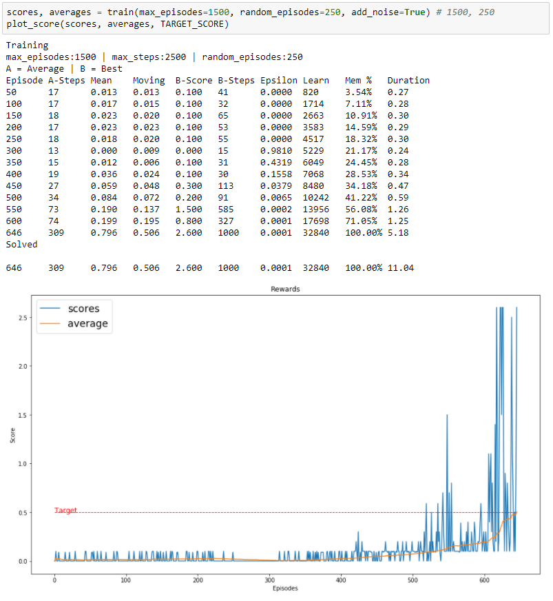
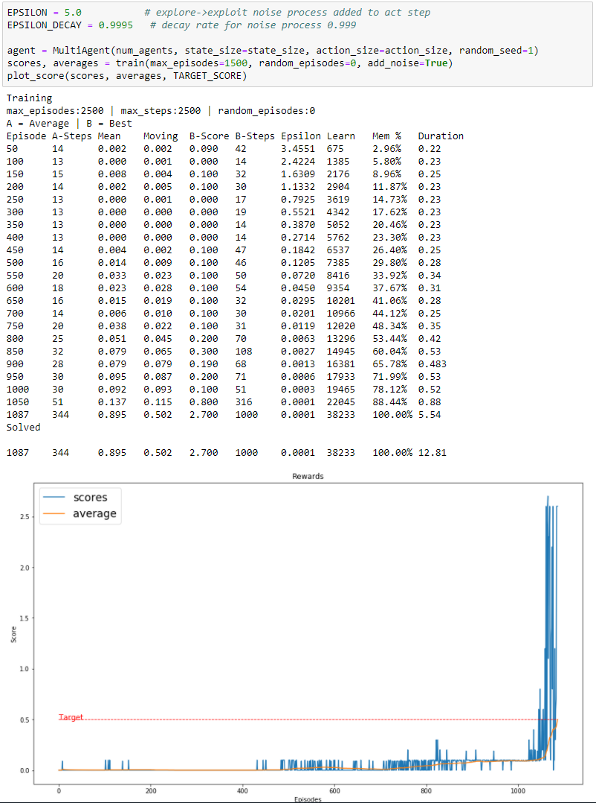
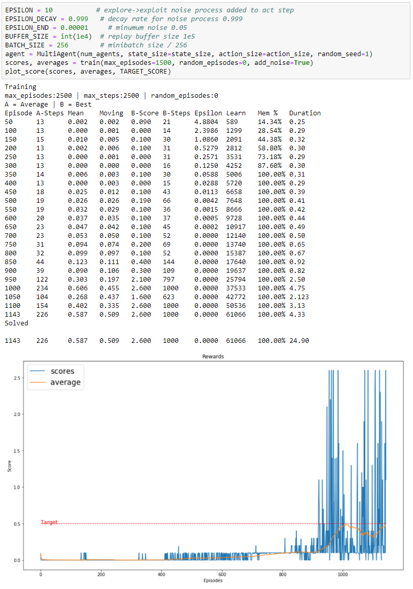

# Project 3: Multi-Agent Collaboration & Competition
 
## Environment
 
 
I used a Multi-Agent to control 2 agents that learned from the same memory pool. This gave the ability for the Multi Agent to share memory to train the other agents separately. This environment has a continuous action space which increases complexity, from which both agents output 2 actions.
 
 
## Deep Deterministic Policy Gradient (DDPG)
 
 
I choose to use the Deep Deterministic Policy Gradient algorithm (DDPG) which you can find more information in the paper [Continuous Control with Deep Reinforcement Learning](https://arxiv.org/abs/1509.02971).
 
With this we use an "actor-critic, model-free algorithm based on the deterministic policy gradient that can operate over continuous action spaces" for this environment.
 
 
## Actor-Critic Method
 
 
Both Actor and Critic networks receive the state as 24 variables. The Multi Agent is mainly used to feed information to and from the 2 individual agents. 
 
Each individual actor outputs 2 numbers as its best predicted actions for that state, based on its optimal policy π deterministically by maximizing reward through gradient ascent.
 
The Critic outputs the prediction of the target value based on the given state which is it's optimal action-value function Q(s, a) by using the Actor's predicted action.
 
This method uses the strengths of both policy-based and value based methods.
 
 
## Epsilon Greedy Algorithm
 
 
The exploration vs. exploitation dilemma is solved with an epsilon greedy algorithm. This allows the agent to explore some of the time and choose the best path for others. As it trains it explores, chooses a random action, and slowly starts to choose the path it has determined to be the best. So we use a starting value, a decay factor and a final value. After every episode we 'decay' or reduce the starting value lower to a minimum so there is always a little exploring to do.
 
e = max(e*decay, min)
 
In this project we added noise to our actions, it seemed to be very important to reduce the noise over time at just the right amount in order to explore enough for proper training.
 
For the first training session I tested 250 episodes with completely random actions then went on to use the Epsilon Greedy Algorithm. After that was able to complete the environment the next training session used a higher exploration variable to complete the environment. 
 
 
## Experience Replay
 
 
Experience replay allows the RL agent to learn from past experience as each state, action, reward, and next state (s, a, r, s') are saved in memory. Then samples are drawn from this buffer as part of the training. The samples are randomly selected so that the data is uncorrelated. This creates a smooth learning experience, and also provides the ability to reuse the data. Perhaps similar to us dreaming.
 
 
## Hyperparameters
 
 
I choose to use the [Deep Deterministic Policy Gradient algorithm (DDPG)](https://arxiv.org/abs/1509.02971) with Experience Replay to solve this challenge in ~100 Episodes.  Below are some variables you can change to see how training is affected. Below are the values I used.
 
1. Agent
    - state_size = 24         # Input / State size
    - action_size = 2         # Output size of each agent
    - TARGET_SCORE = 0.5      # score to achieve
    - TARGET_EPISODES = 100   # episodes needed to achieve average score
 
    - BUFFER_SIZE = int(5e4)  # replay buffer size
    - BATCH_SIZE = 128        # minibatch size
 
    - GAMMA = 0.99            # discount factor
    - TAU = 1e-3              # for soft update of target parameters
    - LR_ACTOR = 1e-3         # learning rate of the actor 
    - LR_CRITIC = 1e-3        # learning rate of the critic #5e-3  
    - WEIGHT_DECAY = 0        # L2 weight decay
    - EPSILON = 2.0           # explore->exploit noise process added to act step
    - EPSILON_DECAY = 0.999   # decay rate for noise process 
    - EPSILON_END = 0.0001    # minimum noise 
 
    - THETA=0.2             # Ornstein-Uhlenbeck noise parameter, speed of mean reversion
    - SIGMA=0.2             # Ornstein-Uhlenbeck noise parameter, volatility
    - Actor layers = [128, 128]
    - Critic layers = [128, 128]
 
2. Training
    - max_episodes = 1500       # Maximum number of training episodes
 
At first I was having trouble with the agent exploring enough so I hard coded random actions into the training and even tried a function to fill the memory with random actions to find a solution.
 
I left the fill memory function for reference which was helpful for diagnosing exploration problems and added the ability to prioritize saving steps with a reward as feedback. I ended up not using it, but something I will use in the future to assist with training and exploration problems.
 
 
 
## Results
In my first attempt, I started with 250 episodes of random actions to then went on with the normal training. 
 

 
 
After that training, I increased the Epsilon to 5 and reduced the decay to 0.9995 and removed the random episodes.
 

 
 
The last time I trained I increased the Epsilon to 10 and reduced the decay to 0.999 and lowered the memory size and increased the batch size.
 

 
 
I learned alot from this project. Most importantly take notes of hyperparameters tweaks and save results. I also documented a lot more information to make sure training was going well, and see how much memory I was utilizing. Also to make sure I didn't make a mistake with the scorekeeping I also monitored average steps (A-Steps) and best steps / score (B-Steps / B-score)
 
 
## Future
 ***********************
1. I could had added batch normalization to keep both model's.
2. Make a function to test many hyperparameters of a smaller range of episodes / steps to get an idea of what works best.
3. Prioritize memory replay based on reward
4. Change the hyperparameters of each agent and track them individually to see which one learns faster and better.
5. Add the ability to train multiple passes with every memory sample. 
6. Try some other algorithms.
 - [Proximal Policy Optimization (PPO)](https://arxiv.org/pdf/1707.06347.pdf)
 - [Asynchronous Advantage Actor-Critic (A3C)](https://arxiv.org/pdf/1602.01783.pdf), and - [Distributed Distributional Deterministic Policy Gradients (D4PG)](https://openreview.net/pdf?id=SyZipzbCb)
 
 
## Config
 
 
I ended up using Udacity's built in workspace and training on GPU and it took about an hour to train. No visual was used.
